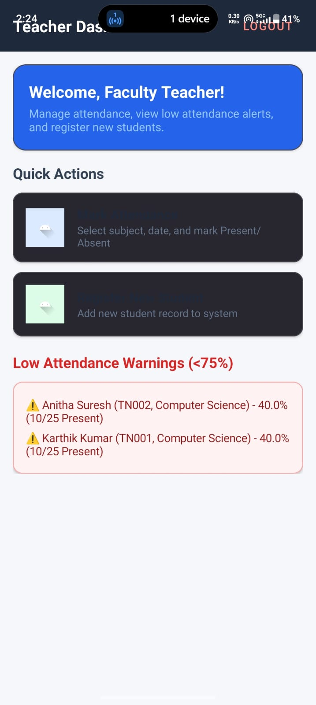
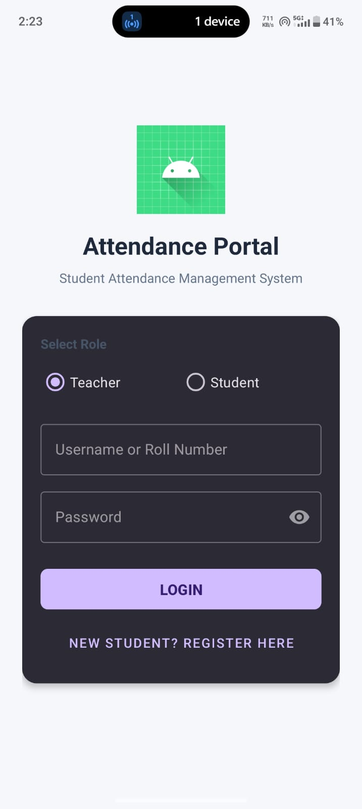
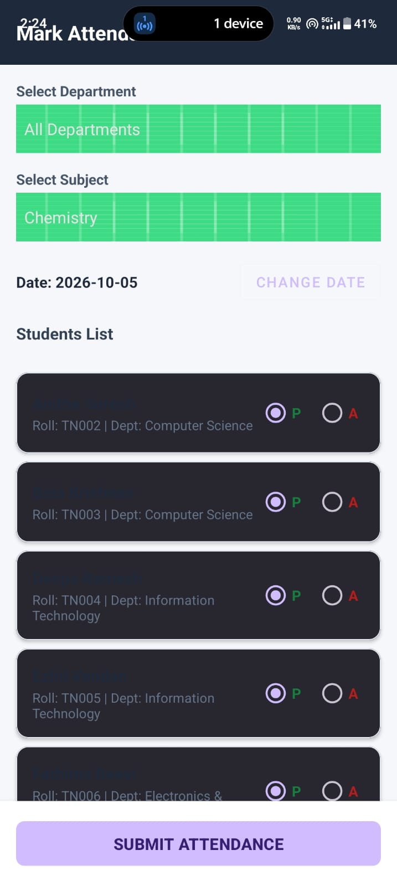
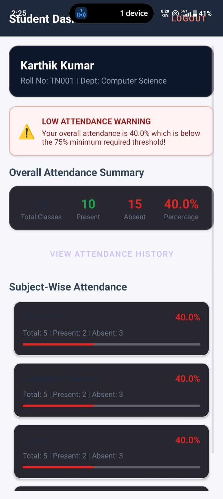
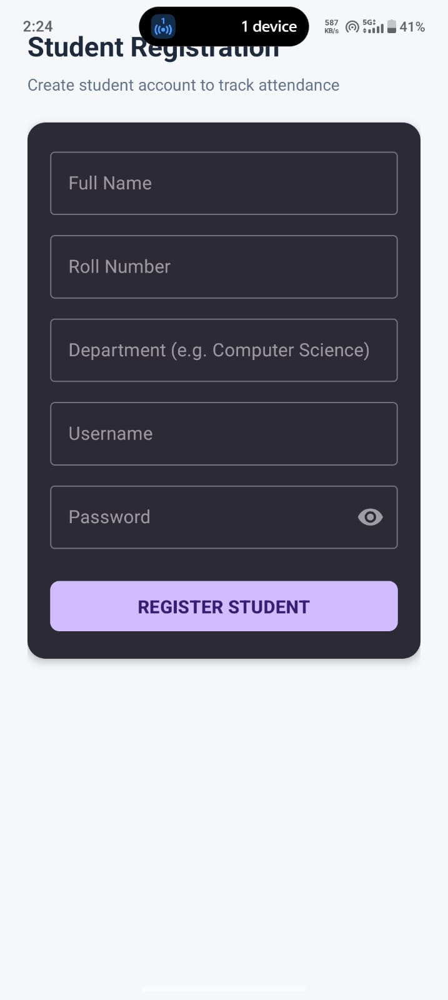
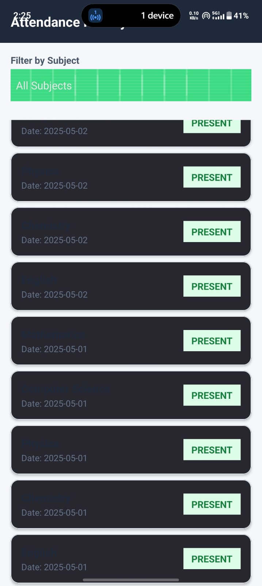

# Student Attendance Management System

A comprehensive Android application designed to streamline the process of tracking student attendance. This system replaces traditional paper-based attendance marking with a digital solution, providing teachers with an efficient way to manage records and students with a transparent view of their attendance history.

## 🚀 Features

- **Secure Authentication:** Login system for teachers and students.
- **Student Management:** Easy registration and management of student profiles.
- **Efficient Attendance Marking:** Quickly mark attendance for subjects with a user-friendly interface.
- **Detailed History:** View and track attendance records over time.
- **Dual Dashboards:** Custom views for both Teachers (management) and Students (tracking).
- **Local Database:** Utilizes SQLite for robust and fast data storage on the device.

## 📸 Screenshots

  
  
  
  
  
  

## 🛠️ Tech Stack

- **Language:** Java
- **IDE:** Android Studio
- **Database:** SQLite
- **UI Framework:** XML (Android Layouts)

## ⚙️ Installation

1. Clone the repository:
   \`\`\`bash
   git clone https://github.com/HARRIS-IT/student-attendance-management-system.git
   \`\`\`
2. Open the project in **Android Studio**.
3. Sync the project with Gradle files.
4. Run the app on an emulator or a physical Android device.

## 📄 License

This project is open-source and available under the [MIT License](LICENSE).
